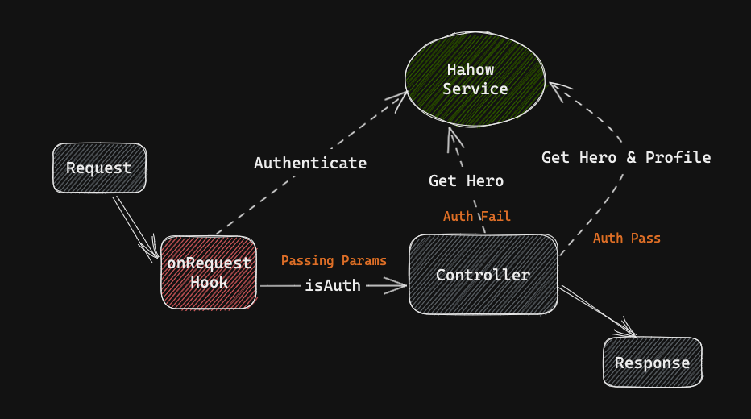

# Hero App

## Run the api server

#### clone the repo

```bash
git clone git@github.com:pgtagtoo/hero-app.git
cd hero-app
```

#### install dependencies

```bash
npm install
```

#### build and watch

```bash
npm run build
```

#### run the server on port 8080

```bash
npm start
```

####  Testing

```
npm run test
```

## API Server



## Packages Introduction

### Fastify

Fastify is a fast and low overhead web framework for Node.js,offering the ability to extend its functionalities through plugins, which include routes and server decorators.
Additionally, hooks can be utilized to listen to specific events in the application or request/response lifecycle.
Moreover, the Decorators API enables customization of the core Fastify objects.

### Pino Pretty
For Prettier logging 

### Vitest

Vitest is a powerful unit testing framework that leverages the capabilities of Vite.
It offers an array of modern features, including component testing for Vue, React, Svelte, and more.
By utilizing worker threads to isolate tests and execute them in parallel, Vitest enhances performance and reliability, particularly for intricate tests and projects.
Additionally, Vitest seamlessly integrates with Jest assertions, simplifying the migration process from Jest to Vitest.


### Mock Service Worker

Mock Service Worker is an API mocking library for browser and Node.js that uses a Service Worker to intercept requests that actually happened.

## Comment

- Complex algorithm and complex logic
- Unclear response 
- Some side effect you need to warn other developers and remind yourself
- Tricky handling environment or dependency
- Explain unidiomatic code 

## Problems

Mocking class implementations for the Hahow API service for testing purposes is not efficient.
I need to override the class using prototypes. Even if the library allows class-to-class overwriting, it can still be quite cumbersome.
That's why I have discovered the Mock Service Worker, which enables network mocking.
When implemented in a dedicated layer, mocking can be a seamless and pleasant experience.
